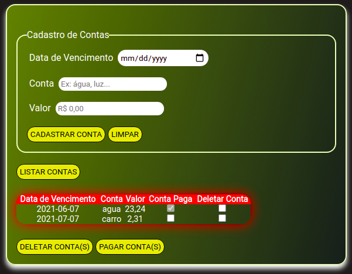

<h1 align="center">
   Cadastro de Contas
</h1>

<p align="center">
  <a href="#-tecnologias">Tecnologias</a>&nbsp;&nbsp;&nbsp;|&nbsp;&nbsp;&nbsp;
  <a href="#-projeto">Projeto</a>&nbsp;&nbsp;&nbsp;|&nbsp;&nbsp;&nbsp;
  <a href="#-projeto">Como executar</a>
</p>

<p align="center">
  
</p>

## 🔧 Tecnologias 

Esse projeto foi desenvolvido com as seguintes tecnologias:

- HTML
- CSS
- JavaScript

## 🚀 Como executar

Clone o projeto e acesse a pasta do mesmo.

```bash
$ git clone https://github.com/angelbotazoli/CadastroDeContas.git
$ cd CadastroDeContas
```

Para iniciá-lo, siga os passos abaixo:
```bash
# Iniciar o projeto
$ xdg-open index.html
```

## 💻 Projeto

O Cadastro de Contas é uma aplicação simples porém funcional, sendo possível cadastrar ou listar as contas cadastradas, deletar ou marcar como paga uma ou mais contas e, como extra, valida os campos não preenchidos e limpa os campos. O cadastro e o pagamento de contas são armazenados no localStorage do browser.

<br>

---
Desenvolvido após [imersaoDev](https://imersao.dev/) como aquecimento para a [nlw6](https://nextlevelweek.com/pre-nlw) :wink:

